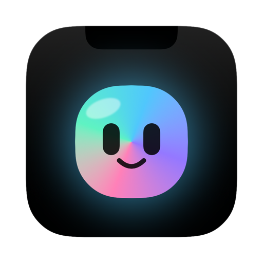
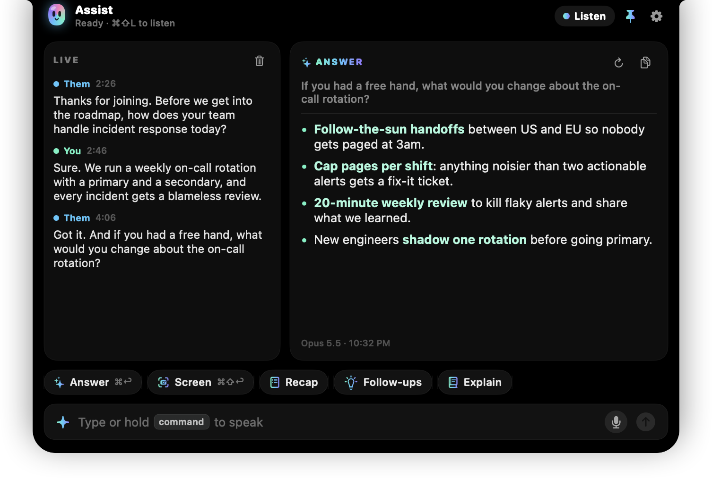
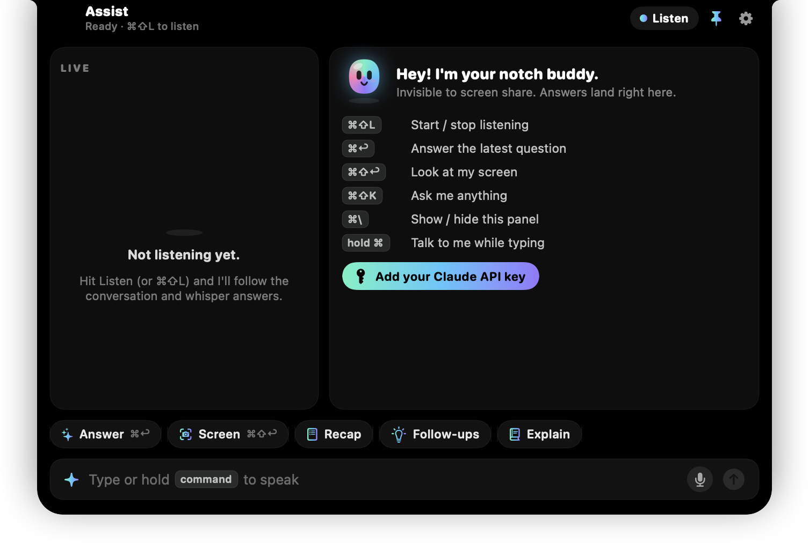
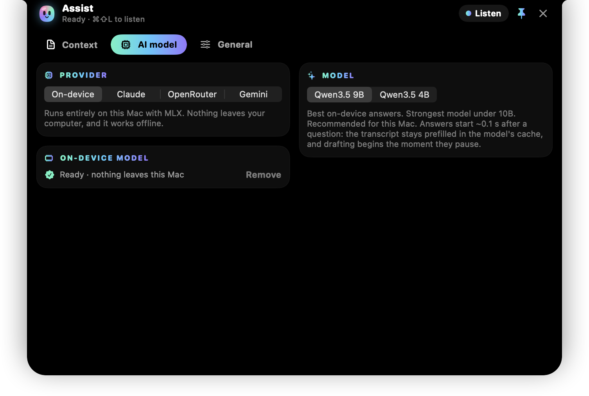
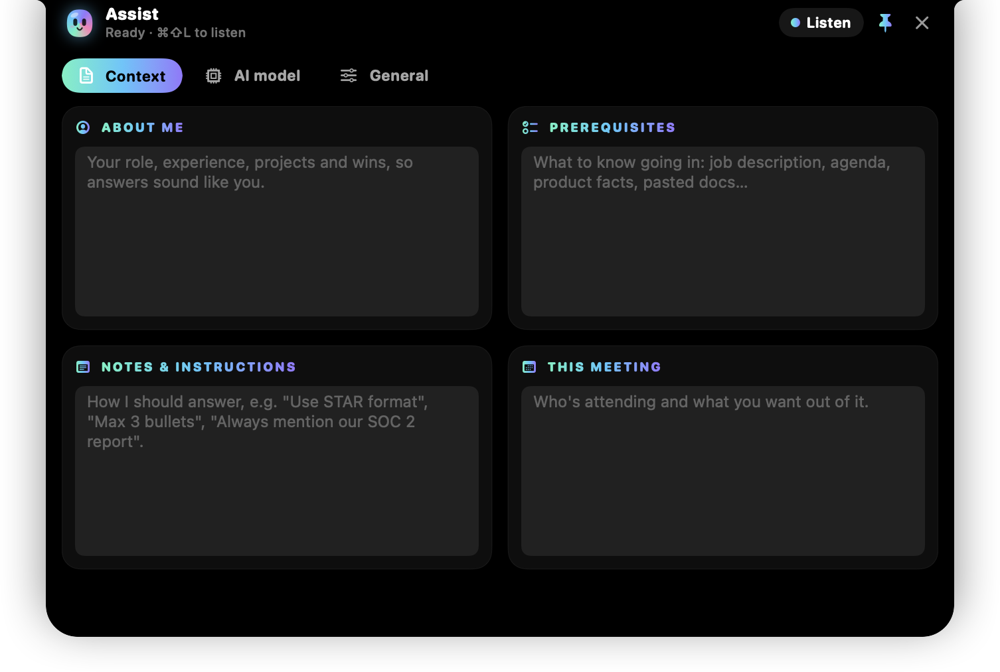
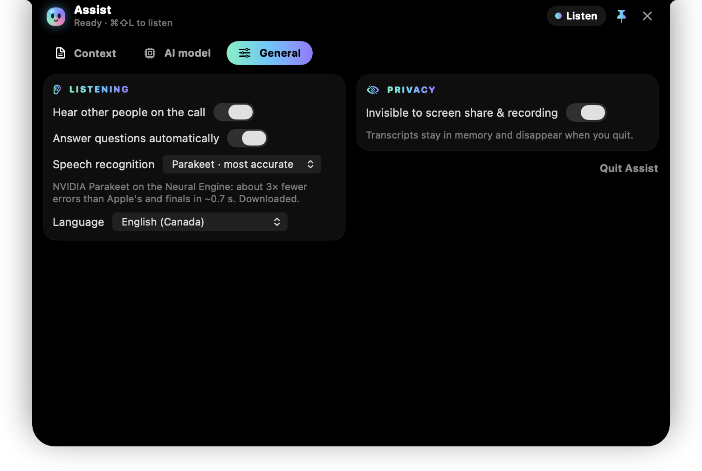

# Assist

### A personal, secure meeting assistant that lives in your MacBook's notch

Listens to your meeting · suggests what to say · invisible on screen share · can run 100% on your Mac

 

 

Hi, I'm Hariharasudhan, and I built **Assist**.

Assist is a small Mac app that sits in the notch at the top of your MacBook screen. During a meeting it listens along, writes a live transcript, and when someone asks you a question, it quietly suggests what you could say back. Nobody else on the call can see it.

I built it to be a meeting assistant you can actually trust: it can run entirely on your own Mac, it stays out of screen shares, and it forgets everything the moment you quit.

  
   
  Assist mid-meeting: the live transcript on the left, a suggested answer on the right.

## What you can use it for

- **Interviews and pitches**: Assist catches the question and gives you talking points built from your own experience.
- **Sales calls and demos**: product facts, pricing and answers to objections, ready the moment the customer asks.
- **Client and team meetings**: zoned out for a minute? Hit **Recap** to catch up, action items included.
- **Calls full of jargon**: hit **Explain** to learn what that acronym means, plus one smart thing to say about it.
- **Anything on your screen**: a shared doc, a slide, a coding problem. Hit **Screen** and Assist helps with it.

## Why it's secure 🔒

| | |
|---|---|
| 🏠 **Runs entirely on your Mac** | Choose **On-device** and the AI runs on your Mac's own chip. No account, no API key, and no internet once it's set up. Your meeting never leaves your computer. |
| 🫥 **Invisible on screen share** | Zoom, Google Meet, Teams, QuickTime and screenshots don't see the Assist panel. |
| 🧽 **Keeps nothing** | Audio is never saved. The transcript lives only in memory and disappears the moment you quit. |
| 🔑 **Keys stay locked up** | If you use a cloud AI, its API key goes into your macOS Keychain, not a file. |
| 🎛️ **You're in charge** | Assist only listens after you press **Listen**, and macOS shows its mic indicator the whole time. |

## Before you start

- A Mac with **Apple silicon** (M1 or newer). It's designed for MacBooks with a notch.
- **macOS 26 Tahoe** or newer.
- For the fully private on-device mode: about **7 GB** of free space (about 4 GB with the smaller model). More memory is better; Assist suggests the model that suits your Mac.

## Set it up in 5 easy steps

### 1. Install

1. Open **Assist.dmg**.
2. Drag **Assist** into your **Applications** folder.
3. Open Assist from Applications (or press `⌘ Space` and type "Assist").

> [!TIP]
> **macOS says it can't verify Assist?** That can happen with apps downloaded outside the App Store. Open **System Settings → Privacy & Security**, scroll down, and click **Open Anyway** next to Assist. You only need to do this once.

### 2. Find it in the notch

Assist doesn't have a Dock icon. Move your mouse over the notch at the top of your screen and the panel opens. You can also press `⌘ \` anytime to show or hide it.

  

### 3. Choose the AI

Click the ⚙️ gear at the top right of the panel, open **AI model**, and choose where the thinking happens:

| Provider | Privacy | What you need |
|---|---|---|
| **On-device** ⭐ | 🔒 Nothing leaves your Mac. Works offline. | Just click **Download** once: 6.1 GB for Qwen3.5 9B (smartest), or 3.2 GB for Qwen3.5 4B (fastest). |
| **Claude** | Meeting text goes to Anthropic | An API key from [console.anthropic.com](https://console.anthropic.com) |
| **OpenRouter** | Meeting text goes to OpenRouter | An API key from [openrouter.ai/keys](https://openrouter.ai/keys) |
| **Gemini** | Meeting text goes to Google | An API key from [aistudio.google.com/apikey](https://aistudio.google.com/apikey) |

For a cloud provider, paste your key and click **Save**. It goes straight into your Keychain.

  

### 4. Add your context

Still in settings, open **Context**. The more you add, the more the answers sound like *you*. Every box is optional:

- **About me**: your role, experience, projects and wins. Assist only uses facts from here, so it won't make things up about you.
- **Prerequisites**: what to know going in, like a job description, an agenda, product facts or pasted docs.
- **Notes & instructions**: how Assist should answer, like "Use STAR format" or "Max 3 bullets".
- **This meeting**: who's attending and what you want out of it.

  

### 5. Press Listen 🎧

Click **Listen** (or press `⌘ ⇧ L`). The first time:

- Assist downloads its speech model (0.6 GB). Just once.
- macOS asks for two permissions. Please allow both:
  - **Microphone**, to hear you and anyone in the room with you.
  - **Screen & System Audio Recording**, to hear the other people on the call and to read your screen when you ask. After allowing it, quit and reopen Assist. If macOS also asks to let Assist "bypass the private window picker", allow that too.

If you skip Screen & System Audio Recording, Assist still works using just the mic (you'll see "Room" in the transcript).

**That's it. You're ready for your next meeting.** ✨

## During a meeting

When someone asks you a question, Assist notices as soon as they pause and starts writing an answer. With the on-device model, the first words usually appear about half a second after they stop talking. If the panel is closed, a one-line peek slides out under the notch so you can glance at it without opening anything.

Prefer to ask for answers yourself? Turn off **Answer questions automatically** in **⚙️ → General**.

The buttons:

| Button | What it does |
|---|---|
| ✨ **Answer** | Writes what to say to the latest question, right now. |
| 🖥️ **Screen** | Looks at your screen and helps with what's on it. Type a question first if you want something specific. |
| 📝 **Recap** | The key points so far, plus decisions and action items. |
| 💡 **Follow-ups** | Three sharp things you could say or ask next. |
| 📘 **Explain** | Breaks down the latest bit of jargon, plus one line you can say to show you get it. |
| 💬 **Ask anything** | Type in the box at the bottom, or hold `⌘` and talk. What you type stays private. (Mute yourself in the meeting before talking to Assist!) |

## Shortcuts

| Keys | What it does |
|---|---|
| `⌘ ⇧ L` | Start or stop listening |
| `⌘ ↩` | Answer the latest question now |
| `⌘ ⇧ ↩` | Look at your screen and help |
| `⌘ ⇧ K` | Open the panel and type a question |
| `⌘ \` | Show or hide the panel |
| hold `⌘` | Talk instead of typing (while the panel is open) |
| `⌘ ←` / `⌘ →` | Previous or next answer |
| `Esc` | Close |

## Meet the buddy 🫧

I gave Assist a little buddy with moods of its own. Close the panel and it gets drowsy, yawns, and dozes off (snot bubble and floating z's included). Hover over the notch and it stirs awake. While Assist is listening it bops along to the conversation, bounces when it hears a question, wobbles while it thinks, and grins with sparkles when your answer is ready. Click it for a twirl and a heart. 💜

  
  &nbsp;&nbsp;
  
   
  Napping vs. ready to help

## Privacy, in plain words

- **Your audio** is turned into text right on your Mac and never saved.
- **Your transcript** lives only in memory. Quit Assist and it's gone.
- **In on-device mode**, nothing about your meeting leaves your Mac. The only time Assist uses the internet is to download its models, once, from Hugging Face.
- **In cloud mode** (Claude, OpenRouter or Gemini), Assist sends only what it needs to answer: the recent conversation, your Context notes and your question. A screenshot is sent only when you press **Screen**. (In on-device mode, **Screen** reads the text on your screen locally instead.)
- **Your API keys** are kept in the macOS Keychain.

  

**About being invisible:** Assist uses macOS's built-in "hide from screen capture" setting, so Zoom, Meet, Teams, QuickTime and screenshots leave it out. Still:

- Test once with your own meeting app before you rely on it.
- It can't hide from a phone camera pointed at your screen, a capture card, or someone looking over your shoulder.
- The macOS mic and screen-recording indicators in the menu bar stay visible. That's a macOS privacy protection.

> [!IMPORTANT]
> **Be fair to the people you meet.** Recording or transcribing others may require their consent where you live. Please check before using Assist in a meeting.

## Questions

<b>Assist can't hear the other people on the call.</b>

Open **System Settings → Privacy & Security → Screen & System Audio Recording**, turn Assist on, then quit and reopen Assist. Also check that **⚙️ → General → Hear other people on the call** is on.

<b>The panel shows up when I share my screen.</b>

Make sure **⚙️ → General → Invisible to screen share & recording** is on, then test again with your meeting app.

<b>Can I use a language other than English?</b>

Yes. In **⚙️ → General → Speech recognition**, switch from Parakeet (most accurate, English only) to Apple's recognizer, which works in every language macOS supports. Then pick your **Language**.

<b>Do I need the internet?</b>

Only for the first-time model downloads. After that, in on-device mode, Assist works completely offline.

<b>How do I quit?</b>

Open the panel, click ⚙️, go to **General** and click **Quit Assist**.

<b>How do I uninstall?</b>

1. If you downloaded the on-device model, click **Remove** under **⚙️ → AI model** to free up the space.
2. Quit Assist, then drag it from Applications to the Trash.
3. To clear everything else it downloaded, delete these folders:
   - `~/Library/Application Support/Assist/Models`
   - `~/Library/Application Support/FluidAudio/Models`

 

  
   
  Made with ❤️ by Hariharasudhan

